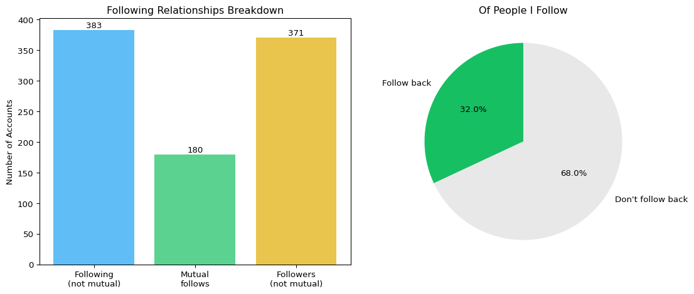

# Following Analysis
Christopher C. Smith
2025-08-16

- [Summary Statistics](#summary-statistics)
- [Reciprocal Following
  Visualization](#reciprocal-following-visualization)
- [Follow Ratio Analysis](#follow-ratio-analysis)
- [Key Insights](#key-insights)

## Summary Statistics

    **Accounts I follow:** 563
    **Accounts that follow me:** 551
    **Mutual follows:** 180

    **Share of accounts I follow who follow me back:** 32.0%
    **Share of my followers that I follow:** 32.7%

## Reciprocal Following Visualization

## Follow Ratio Analysis

    **Follow ratio (followers/following):** 0.98

    You follow 1.02x more accounts than follow you.

## Key Insights

    - Moderate reciprocity rate (32.0%) suggests a balanced mix of mutual connections and one-way follows

------------------------------------------------------------------------

*Note: This analysis is based on account IDs only. Future enhancements
could include username resolution and interaction analysis.*
